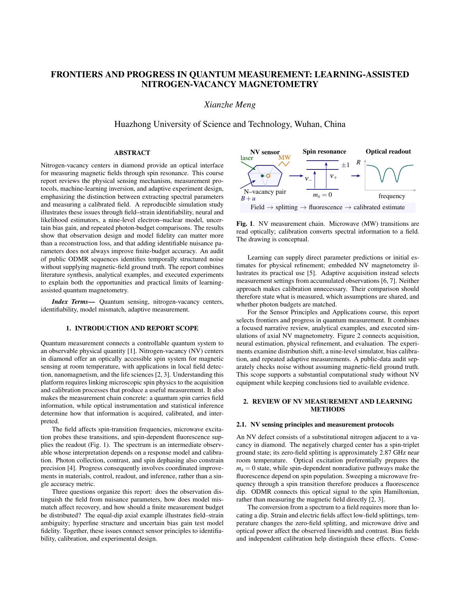
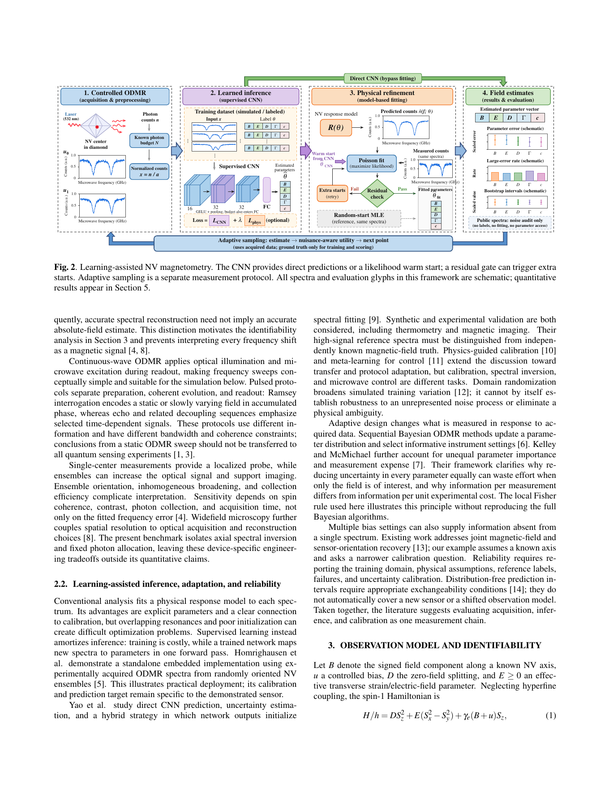
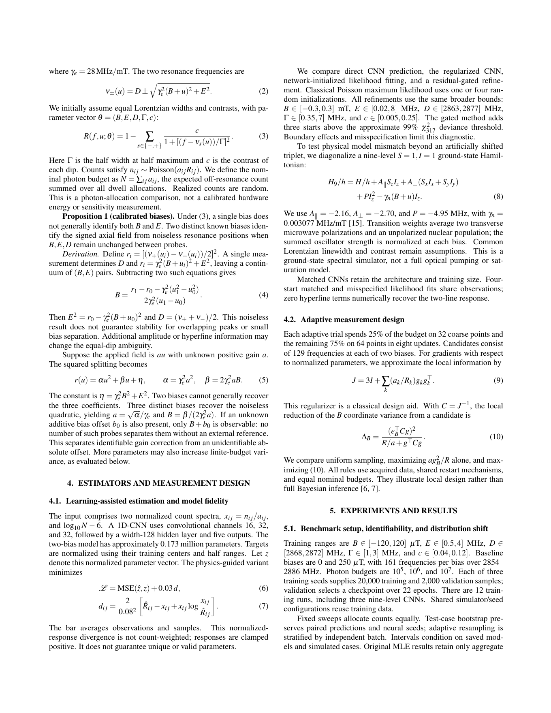
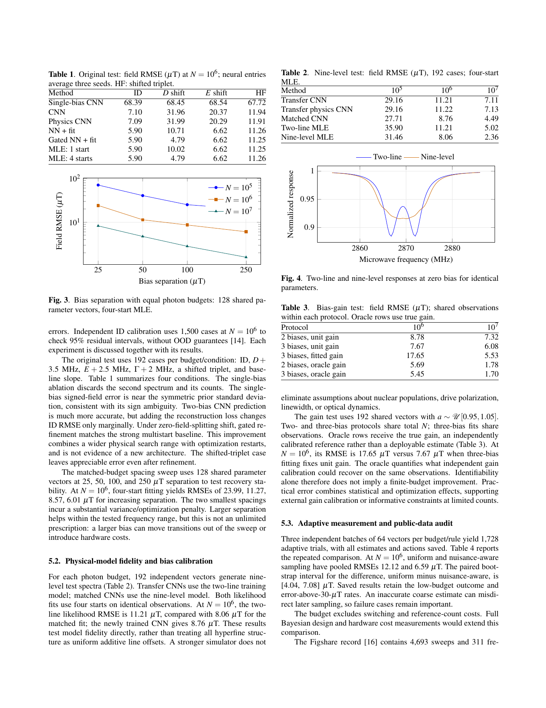
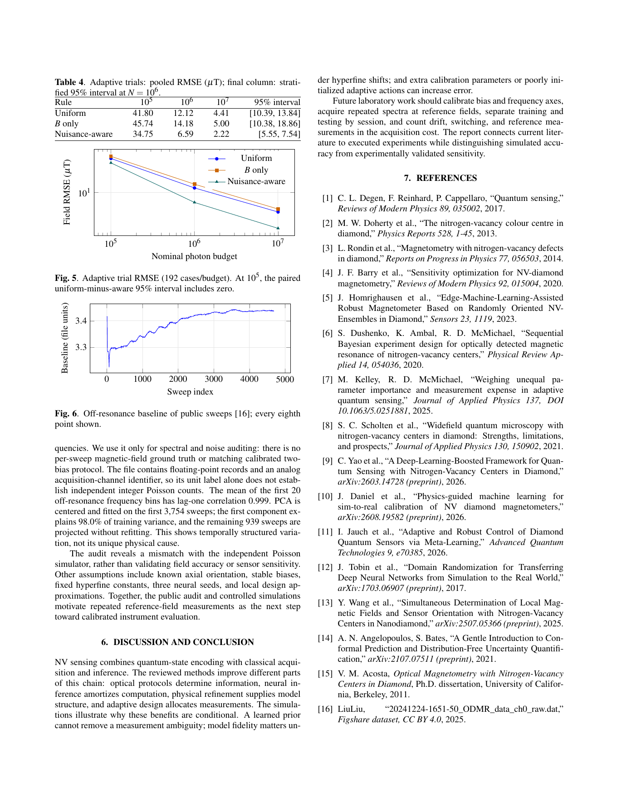

# Course Report

**Frontiers and Progress in Quantum Measurement: Learning-Assisted Nitrogen-Vacancy Magnetometry**

Xianzhe Meng · Huazhong University of Science and Technology

[**Read / download the full five-page PDF**](report/NV_Quantum_Measurement_Report.pdf)

A focused literature review, analytical identifiability examples, and executed simulation studies for the Sensor Principles and Applications course. The report uses a compact two-column layout.

[](report/preview/page-1.png)

[](report/preview/page-2.png)

[](report/preview/page-3.png)

[](report/preview/page-4.png)

[](report/preview/page-5.png)

---

# Sensor Technology Assignment: NV Quantum Magnetometry

Code and recorded computational evidence for a **Sensor Principles and Applications** course assignment on **Frontiers and Progress in Quantum Measurement**. The study examines magnetic-field estimation from nitrogen-vacancy (NV) optically detected magnetic resonance (ODMR), combining physical modeling, neural inference, likelihood fitting, and adaptive acquisition.

This repository contains the five-page English course report, experiment code, trained checkpoints, training histories, saved predictions, and scientific plots.

## What is evaluated

- **Identifiability:** a zero-bias axial spectrum cannot distinguish the sign of the field or uniquely separate field and strain. A calibrated second bias resolves the ambiguity under the stated model.
- **Estimation:** single-bias CNN, two-bias CNN, physics-regularized CNN, neural-initialized likelihood fitting, residual-gated hybrid fitting, and one-/four-start Poisson maximum-likelihood estimation (MLE).
- **Model mismatch:** zero-field splitting, strain, linewidth, unresolved hyperfine structure, and baseline drift.
- **Measurement design:** bias spacing, uncertain bias gain, and uniform versus field-only versus nuisance-aware adaptive photon allocation.
- **Public-data audit:** spectra, temporal baseline correlation, and principal-component analysis of an attributed experimental ODMR dataset.

All magnetic-field error comparisons are **simulations**. The public dataset has no per-sweep ground-truth magnetic-field labels and is used only for descriptive spectral/noise analysis. No NV hardware experiment or experimental sensitivity is claimed.

## Installation

Use Python 3.10 or newer in a virtual environment. From the repository directory:

```sh
python -m venv .venv
# Windows PowerShell: .\.venv\Scripts\Activate.ps1
# Linux/macOS: source .venv/bin/activate
python -m pip install -r requirements.txt
```

The recorded run used NumPy 1.26.4, SciPy 1.13.1, Matplotlib 3.9.2, and PyTorch 2.11.0+cu128 (see `results/environment.json`). Dependency ranges in `requirements.txt` are installation bounds, not a claim that every permitted version has been tested. The recorded environment also lists scikit-learn; these scripts do not require it.

CPU execution is supported. CUDA is selected when available. To force CPU:

```powershell
$env:NV_DEVICE = "cpu"
```

On Linux/macOS use `export NV_DEVICE=cpu`. Checkpoints are loaded onto the selected device, including GPU-trained checkpoints on CPU. Different hardware and library versions can change training trajectories and timings.

## Quick verification (no training)

```sh
python verify_snapshot.py
```

This checks independent axial Hamiltonian eigenvalues, NumPy/PyTorch forward agreement, the zero-hyperfine limit of the nine-level model, sign ambiguity, all 12 CPU checkpoint loads and forward passes, and consistency of 126 original and 51 extended summary groups with their saved inputs. It leaves the recorded results unchanged.

## Public data and summary regeneration

```sh
python download_data.py
python validate_physics.py
python summarize.py
python summarize_extended.py
```

The downloader retrieves the original 18.97 MB Figshare file, verifies its size and SHA-256, and saves `odmr_public.dat` beside the scripts. The raw file is excluded from Git; attribution, source, and CC BY 4.0 terms are in [DATA_LICENSE.md](DATA_LICENSE.md). The summary commands regenerate tables and plots from the saved predictions and metrics. `validate_physics.py` updates its validation record; summary commands overwrite their corresponding summary/plot files.

## Reproduce the benchmark

Run these commands in order after downloading public data:

```sh
python run_study.py --train 20000 --epochs 22 --cases 192 --seeds 3
python gated_study.py --cases 192
python adaptive_study.py
python extended_study.py spin --cases 192
python extended_study.py design --cases 128
python extended_study.py gain --cases 192
python extended_study.py adaptive --cases 64
python summarize.py
python summarize_extended.py
```

These commands reuse the supplied checkpoints and rerun the simulation/fitting evaluations. They overwrite result files. To repeat the original nine model-training runs, add `--retrain` to `run_study.py`. For completely fresh training of all 12 models, start in a separate copy of the repository without the supplied `results/*.pt` files; the commands train missing checkpoints. The spin-model training protocol is fixed at 20,000 training spectra and 22 epochs. Full fitting and adaptive experiments take substantially longer than quick verification; no universal runtime estimate is provided.

## Recorded experiment scale

| Component | Recorded protocol |
| --- | --- |
| Original neural models | 3 configurations × 3 seeds; 20,000 training and 2,000 validation spectra per run; 22 epochs |
| Original evaluation | 6 scenarios × 3 photon budgets × 192 cases = 3,456 latent-parameter/observation pairs, shared across estimators |
| Spin-9 extension | 3 additional matched CNN training runs; 5 estimators × 3 budgets × 192 test cases; neural estimators use 3 seeds |
| Bias spacing | 128 latent vectors × 4 spacings × 3 budgets = 1,536 fits |
| Bias gain | 192 latent vectors × 5 protocols × 3 budgets = 2,880 fits |
| Original adaptive pilot | 96 cases × 3 policies × 3 budgets = 864 trials |
| Repeated adaptive evaluation | 3 batches × 64 cases × 3 policies × 3 budgets = 1,728 trials |
| Public data audit | 4,693 sweeps × 311 frequency points |

Neural configurations share simulator draws for a given seed; these are not independent datasets. Extended summaries use 2,000 bootstrap resamples; adaptive confidence intervals preserve pairing and resample within each batch. Original summaries use 1,000 resamples where per-case predictions were saved. Original MLE outputs and the initial adaptive pilot do not retain complete per-case predictions; their aggregates cannot be independently re-bootstrapped from this snapshot. Repeated adaptive trials retain every estimate and sampling trace. Redundant per-batch adaptive files are omitted because `adaptive_predictions.json` includes all three batches.

## Files

| File or directory | Purpose |
| --- | --- |
| `run_study.py` | Axial two-line ODMR simulator, CNN training, likelihood fitting, identifiability analysis, original benchmark |
| `validate_physics.py` | Independent spin-1 Hamiltonian and differentiable-forward checks |
| `gated_study.py` | Residual-based goodness-of-fit gating and multistart fallback |
| `adaptive_study.py` | Matched-budget adaptive acquisition pilot and acquisition function used by repeated trials |
| `extended_study.py` | Spin-1 × nuclear-spin-1 Hamiltonian, bias spacing/gain, repeated adaptive evaluation |
| `summarize.py`, `summarize_extended.py` | Tables, plots, bootstrap intervals, and gain-algebra validation |
| `download_data.py` | Attributed, hash-verified public-data download |
| `verify_snapshot.py` | Fast CPU checks without changing saved evidence |
| `results/` | Checkpoints, training histories, original metrics/predictions, audit records, plots, environment and run manifest |
| `results/extended/` | Extended predictions, all repeated adaptive traces, summaries, and validation records |

## Modeling and interpretation

The target is a **signed scalar field along a known NV axis**, not arbitrary three-dimensional vector magnetometry. Frequency units are MHz, field units are mT, and reported field RMSE is in µT. The baseline has 161 frequency points from 2854 to 2886 MHz and two calibrated biases (0 and 0.25 mT). The single-bias CNN discards the second channel from the same two-bias acquisition; it is an input-information ablation, not a reallocation of the entire photon budget to one scan.

The nominal photon budget is the summed expected off-resonance count allocation across acquisition points. It is not measured energy, realized detected photons, or acquisition time. The nine-level extension assumes axial fields, unpolarized nuclear states, averaged transverse microwave polarizations, equal Lorentzian linewidths, and normalized oscillator strength; it does not model full optical dynamics.

Neural inference is not uniformly superior to likelihood fitting under distribution shift. Oracle-gain comparisons use the simulated true gain and are reference bounds rather than deployable estimators. Coverage calibrated on independent in-distribution data does not establish out-of-distribution coverage. Software timings depend on hardware and batch sizes; `run_manifest.json` records the original invocation and is not a combined runtime for all extensions or all training runs.

The public data is attributed under its original license. No license for third-party data is replaced by this repository, and the data author does not endorse these derived analyses.
